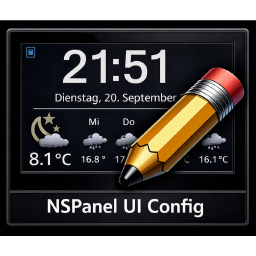

# NSPanel UI Config

**Das NSPanel in Home Assistant zusammenklicken – statt `apps.yaml` von Hand zu pflegen.**

[](https://github.com/joschnurr/nspanel-ui-config/actions/workflows/validate.yml)
[](https://hacs.xyz/)
[](LICENSE)

Eine Home-Assistant-Integration, die einen visuellen Editor für
[nspanel-lovelace-ui](https://github.com/joBr99/nspanel-lovelace-ui) (das AppDaemon-Backend von
joBr99) mitbringt: Karten anlegen, Entities sortieren, Icons und Farben wählen, Templates mit
Live-Vorschau schreiben. Heraus kommt gültige nspanel-YAML für das bestehende Backend.

> **Frühe Entwicklungsphase.** Nutzbar, aber im Fluss. Rückmeldungen sind willkommen.

---

## Warum

nspanel-lovelace-ui ist bewusst rein YAML-basiert – „no need to code, no UI". Für ein einzelnes
Panel geht das gut; mit vielen Karten, Entities, Icon- und Farb-Templates wird es unübersichtlich.
Und einiges lässt sich der Datei schlicht nicht ansehen:

- Auf eine `cardEntities` passen **vier** Einträge – ein fünfter steht in der YAML und erscheint
  nie auf dem Display. Ohne Fehlermeldung.
- Ein vertippter Icon-Name wird still zu einem Warndreieck.
- `unit:` sieht plausibel aus, wird vom Backend aber nirgends gelesen.

Der Editor macht genau das sichtbar, bevor es auf dem Panel fehlt.

## Was er kann

**Karten und Entities** – anlegen, umsortieren, Kartentyp wechseln, Entities per Picker aus Home
Assistant wählen. Jedes Feld ist beschriftet mit dem, was es bewirkt, und den Werten, die es
annehmen darf.

**Anzeigekapazität** – „5 von 4 Plätzen": der Editor weiß, wie viele Einträge jeder Kartentyp auf
deinem Panel-Modell wirklich zeigt, und markiert überzählige.
→ [docs/kapazitaet.md](docs/kapazitaet.md)

**Icons** – Vorschau und Vorschläge aus den 6896 Namen, die das Backend tatsächlich kennt, mit
Warnung bei Unbekanntem (ohne den Wert zu verwerfen).

**Farben** – Farbwähler für `[r, g, b]` und für getrennte `on`/`off`-Zustände.

**Templates** – Umschalter „als Template bearbeiten" mit Live-Vorschau über Home Assistants eigene
Template-API. Dieselbe Engine, die später auch das Backend benutzt – also echte Werte und echte
Fehlermeldungen. → [docs/funktionen.md](docs/funktionen.md#template-editor)

**Sicherungen** – vor jedem Überschreiben wird der bisherige Stand weggeschrieben und lässt sich
aus dem Editor zurückholen. → [Datensicherheit](#datensicherheit)

**Import** – eine bestehende `apps.yaml` wird eingelesen und ist der Startpunkt. Nichts geht dabei
verloren, auch keine Einstellung, die dieser Editor noch nicht kennt.

## Wie es funktioniert

Diese Integration ist eine reine **Konfigurations-Schicht**. Das ausgereifte Rendering-Backend von
joBr99 (MQTT-Protokoll ans Nextion-Display, alle Kartentypen, Icon-Mapping) bleibt **unverändert**
und rendert weiter – erzeugt wird nur seine Eingabedatei.

```
┌──────────────────────────┐    schreibt      ┌───────────────────────────┐   liest   ┌────────────┐
│ Home Assistant           │ ───────────────▶ │ gemeinsame Include-Datei  │ ────────▶ │ AppDaemon  │ ─MQTT─▶ NSPanel
│ (diese Integration)      │ nspanel_config   │ (Bind-Mount)              │           │ luibackend │
│  · visueller Editor      │      .yaml       └───────────────────────────┘           └────────────┘
│  · Import der apps.yaml  │                                 ▲                              │
└──────────────────────────┘ ──── Reload-Trigger ────────────┴──────────────────────────────┘
```

Warum kein natives HA-Rendering ohne AppDaemon? Das würde ein großes, reifes Projekt duplizieren.
Der Config-Schicht-Ansatz liefert früh Nutzen und bleibt kompatibel mit Updates des Backends.
→ [docs/architecture.md](docs/architecture.md)

## Voraussetzungen

- Home Assistant 2024.4 oder neuer
- ein laufendes **nspanel-lovelace-ui**-Setup auf AppDaemon
- eine **gemeinsame Datei** zwischen HA- und AppDaemon-Container. Beide laufen in getrennten
  Volumes und teilen sich sonst keinen Pfad; ein einmaliger Bind-Mount genügt.
  → [docs/architecture.md#transport](docs/architecture.md#transport)

## Installation

**Über HACS** (empfohlen): HACS → Integrationen → ⋮ → *Benutzerdefiniertes Repository* →
`https://github.com/joschnurr/nspanel-ui-config`, Kategorie *Integration*. Danach installieren und
Home Assistant neu starten.

**Manuell:** `custom_components/nspanel_ui_config/` nach `<config>/custom_components/` kopieren und
Home Assistant neu starten.

Anschließend *Einstellungen → Geräte & Dienste → Integration hinzufügen → „NSPanel UI Config"*.
Im Dialog werden Ausgabepfad, Reload-Weg und optional eine zu importierende `apps.yaml` abgefragt.
Der Editor erscheint danach als **NSPanel UI** in der Seitenleiste.

## Datensicherheit

Die Integration schreibt in eine Datei in deiner Konfiguration. Zwei Zusagen dazu:

**Nichts geht beim Bearbeiten verloren.** Der Import zerlegt die Konfiguration in benannte Felder;
alles, was der Editor (noch) nicht kennt, bleibt unverändert liegen und wird beim Generieren wieder
herausgeschrieben – auch Keys aus einer neueren Backend-Version. Abgesichert durch Round-Trip-Tests
gegen eine Fixture mit allen Kartentypen und den üblichen YAML-Fallen.

**Nichts wird ungesichert überschrieben.** Vor jedem Schreibvorgang wandert der bisherige Stand
nach `backups/` neben der Ausgabedatei. Lässt sich der alte Stand nicht sichern, wird auch nicht
geschrieben. Über *Sicherungen…* im Editor lässt sich jeder Stand zurückholen – wobei der aktuelle
Stand seinerseits gesichert wird. Wie viele aufgehoben werden, steht in den Optionen (Standard 10,
`0` schaltet ab).

Gegen die eigene Konfiguration testen:

```bash
pip install pyyaml pytest
NSPANEL_REAL_APPS_YAML=/pfad/zu/appdaemon/apps/apps.yaml pytest
```

## Dokumentation

| | |
| --- | --- |
| [Funktionen im Detail](docs/funktionen.md) | Template-Editor, Icons, Farben, Reload-Wege, HTTP-API |
| [Anzeigekapazität](docs/kapazitaet.md) | wie viele Entities je Karte und Modell wirklich sichtbar sind |
| [Architektur](docs/architecture.md) | Transportweg, Datenmodell, Designentscheidungen |
| [Panel-Vorschau](docs/vorschau-machbarkeit.md) | Machbarkeitsuntersuchung (noch nicht umgesetzt) |
| [Änderungen](CHANGELOG.md) | Versionsverlauf |

## Referenzen

- Backend: <https://github.com/joBr99/nspanel-lovelace-ui>
- Doku des Backends: <https://docs.nspanel.pky.eu/>
- Display-Protokoll und HMI-Seiten: `HMI/README.md` im Backend-Repo

Dieses Projekt steht in keiner Verbindung zu joBr99 oder Sonoff/ITEAD.

## Lizenz

[MIT](LICENSE)
