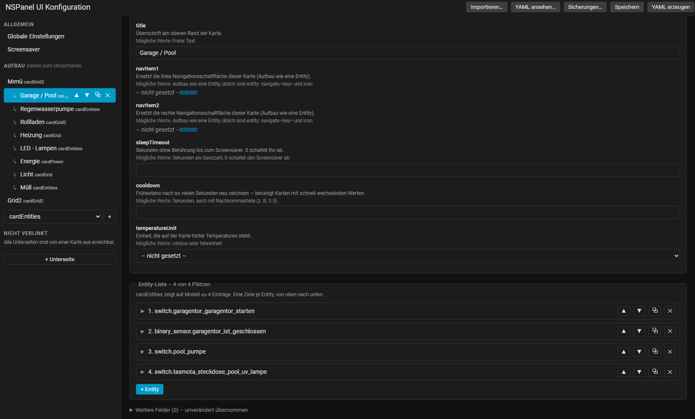
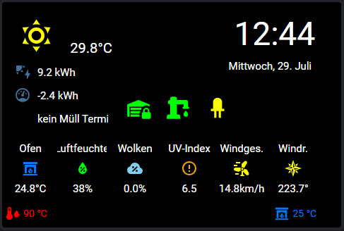

# NSPanel UI Config

**Das NSPanel in Home Assistant zusammenklicken – statt `apps.yaml` von Hand zu pflegen.**

[](https://github.com/joschnurr/nspanel-ui-config/actions/workflows/validate.yml)
[](https://hacs.xyz/)
[](LICENSE)

Eine Home-Assistant-Integration, die einen visuellen Editor für
[nspanel-lovelace-ui](https://github.com/joBr99/nspanel-lovelace-ui) (das AppDaemon-Backend von
joBr99) mitbringt: Karten anlegen, Entities sortieren, Icons und Farben wählen, Templates mit
Live-Vorschau schreiben. Heraus kommt gültige nspanel-YAML für das bestehende Backend.

> **Frühe Entwicklungsphase.** Nutzbar, aber im Fluss. Rückmeldungen sind willkommen.

---

## Warum

nspanel-lovelace-ui ist bewusst rein YAML-basiert – „no need to code, no UI". Für ein einzelnes
Panel geht das gut; mit vielen Karten, Entities, Icon- und Farb-Templates wird es unübersichtlich.
Und einiges lässt sich der Datei schlicht nicht ansehen:

- Auf eine `cardEntities` passen **vier** Einträge – ein fünfter steht in der YAML und erscheint
  nie auf dem Display. Ohne Fehlermeldung.
- Ein vertippter Icon-Name wird still zu einem Warndreieck.
- `unit:` sieht plausibel aus, wird vom Backend aber nirgends gelesen.

Der Editor macht genau das sichtbar, bevor es auf dem Panel fehlt.

## Was er kann

**Karten und Entities** – anlegen, umsortieren, Kartentyp wechseln, Entities per Picker aus Home
Assistant wählen. Jedes Feld ist beschriftet mit dem, was es bewirkt, und den Werten, die es
annehmen darf.

**Navigationsbaum** – die Kartenliste zeigt, wie man am Gerät von Karte zu Karte kommt:
Unterseiten stehen eingerückt unter der Karte, die sie verlinkt. Karten lassen sich per Ziehen
umsortieren und zur Unterseite machen; innerhalb eines Menüs ändert das Ziehen die Reihenfolge der
Menüpunkte. Ein eigener Abschnitt sammelt Karten, die **niemand verlinkt** – am Panel sind die
nicht erreichbar, in einer flachen Liste sieht man das nicht.

**Vorschau** – über jedem Formular eine Nachbildung der Displayfläche in Originalgröße: die
Einträge an ihren Plätzen, mit echten Symbolen, Farben und gerenderten Werten. Die Geometrie ist
aus der Display-Firmware abgemessen, nicht geschätzt. Man sieht, wie die Karte wirkt, bevor sie auf
dem Panel landet. → [docs/funktionen.md](docs/funktionen.md#vorschau)

**Live-Ansicht** – wer ein laufendes NSPanel hat, schaltet die Vorschau auf *vom Gerät*: dann zeigt
sie, was das Backend zuletzt ans Display geschickt hat. Rein lesend über MQTT, nichts wird
veröffentlicht. → [docs/funktionen.md](docs/funktionen.md#live-ansicht-was-das-gerät-wirklich-anzeigt)

**Anzeigekapazität** – „5 von 4 Plätzen": der Editor weiß, wie viele Einträge jeder Kartentyp auf
deinem Panel-Modell wirklich zeigt, und markiert überzählige.
→ [docs/kapazitaet.md](docs/kapazitaet.md)

**Prüfung der Navigation** – die Fehler, bei denen die YAML gültig bleibt und trotzdem eine Karte
verschwindet: ein `navigate.…` ohne passenden Key, zweimal derselbe Key (dann gewinnt immer die
erste Karte), eine Unterseite, die niemand verlinkt, und beide Blättertasten überschrieben – ab da
kommt man durch Blättern nicht mehr weiter.

**Icons** – Vorschau und Vorschläge aus den 6896 Namen, die das Backend tatsächlich kennt, mit
Warnung bei Unbekanntem (ohne den Wert zu verwerfen).

**Farben** – Farbwähler für `[r, g, b]` und für getrennte `on`/`off`-Zustände.

**Templates** – Umschalter „als Template bearbeiten" mit Live-Vorschau über Home Assistants eigene
Template-API. Dieselbe Engine, die später auch das Backend benutzt – also echte Werte und echte
Fehlermeldungen. → [docs/funktionen.md](docs/funktionen.md#template-editor)

**Sicherungen** – vor jedem Überschreiben wird der bisherige Stand weggeschrieben und lässt sich
aus dem Editor zurückholen. → [Datensicherheit](#datensicherheit)

**Import** – eine bestehende `apps.yaml` wird eingelesen und ist der Startpunkt. Nichts geht dabei
verloren, auch keine Einstellung, die dieser Editor noch nicht kennt.

## Wie es funktioniert

Diese Integration ist eine reine **Konfigurations-Schicht**. Das ausgereifte Rendering-Backend von
joBr99 (MQTT-Protokoll ans Nextion-Display, alle Kartentypen, Icon-Mapping) bleibt **unverändert**
und rendert weiter – erzeugt wird nur seine Eingabedatei.

```
┌──────────────────────────┐    schreibt      ┌───────────────────────────┐   liest   ┌────────────┐
│ Home Assistant           │ ───────────────▶ │ gemeinsame Include-Datei  │ ────────▶ │ AppDaemon  │ ─MQTT─▶ NSPanel
│ (diese Integration)      │ nspanel_config   │ (Bind-Mount)              │           │ luibackend │
│  · visueller Editor      │      .yaml       └───────────────────────────┘           └────────────┘
│  · Import der apps.yaml  │                                 ▲                              │
└──────────────────────────┘ ──── Reload-Trigger ────────────┴──────────────────────────────┘
```

Warum kein natives HA-Rendering ohne AppDaemon? Das würde ein großes, reifes Projekt duplizieren.
Der Config-Schicht-Ansatz liefert früh Nutzen und bleibt kompatibel mit Updates des Backends.
→ [docs/architecture.md](docs/architecture.md)

## So sieht es aus



Links der **Navigationsbaum** — Unterseiten stehen eingerückt unter der Karte, die sie verlinkt, und
ein eigener Abschnitt sammelt, was niemand verlinkt. Rechts das Formular: **jedes Feld mit dem, was
es bewirkt** und den Werten, die es annehmen darf. Unten die Entity-Liste mit der Angabe, wie viele
Einträge diese Karte auf diesem Panel-Modell wirklich zeigt — hier *4 von 4 Plätzen*.



Die **Vorschau** zeichnet die Displayfläche in Originalgröße, mit den Einträgen an ihren Plätzen,
echten Symbolen, Farben und gerenderten Templates. So sieht man vor dem Generieren, ob eine
Beschriftung abgeschnitten wird oder eine Farbe auf Schwarz untergeht.

Ein Umschalter darüber wechselt auf **vom Gerät (live)** — dann zeigt dieselbe Fläche, was das
Backend zuletzt wirklich ans Display geschickt hat. Details zu beidem:
[docs/funktionen.md](docs/funktionen.md#vorschau)

## Voraussetzungen

- Home Assistant 2024.4 oder neuer
- ein laufendes **nspanel-lovelace-ui**-Setup auf AppDaemon
- **eine Datei, die Home Assistant und AppDaemon beide sehen.** Was dafür nötig ist, hängt an deiner
  Installationsart — bei zwei der drei Varianten ist es gar nichts:

| Installationsart | AppDaemon läuft als | Gemeinsame Datei | Reload |
| --- | --- | --- | --- |
| **Home Assistant OS / Supervised** | Add-on | `/share/…` – vom Add-on ohne Zutun sichtbar | Add-on über den Supervisor neu starten |
| **Home Assistant Container** | eigener Docker-Container | einmaliger Bind-Mount in beide Container | `touch_module` oder Container-Neustart |
| **Home Assistant Core** (venv) | Prozess auf demselben Host | gleiches Dateisystem, Pfad frei wählbar | `touch_module` |

Der Einrichtungsdialog **erkennt die Installationsart** und belegt Pfad und Reload-Weg passend vor;
überschreiben lässt sich alles. Details:
[docs/architecture.md#transport](docs/architecture.md#transport)

## Installation

**Über HACS** (empfohlen): HACS → Integrationen → ⋮ → *Benutzerdefiniertes Repository* →
`https://github.com/joschnurr/nspanel-ui-config`, Kategorie *Integration*. Danach installieren und
Home Assistant neu starten.

**Manuell:** `custom_components/nspanel_ui_config/` nach `<config>/custom_components/` kopieren und
Home Assistant neu starten.

Anschließend *Einstellungen → Geräte & Dienste → Integration hinzufügen → „NSPanel UI Config"*.
Im Dialog werden Ausgabepfad, Reload-Weg und optional eine zu importierende `apps.yaml` abgefragt.
Angeboten wird dabei nur, was auf deiner Installationsart laufen kann. Der Editor erscheint danach
als **NSPanel UI** in der Seitenleiste.

**Noch keine Konfiguration?** Dann im Editor *Importieren…* öffnen und
[`docs/beispiel-apps.yaml`](docs/beispiel-apps.yaml) einfügen — Ruheanzeige, drei Karten und eine
Unterseite als Gerüst. Die Entities darin sind erfunden; der Editor markiert sie mit ⚠, und genau
diese Stellen ersetzt du durch deine eigenen. Der ganze Ablauf steht in
[docs/einrichtung.md](docs/einrichtung.md#neu-anfangen).

### Bestehende `apps.yaml` umstellen

Die Integration **ändert die `apps.yaml` nie** – sie schreibt eine eigene Datei, die die
`apps.yaml` per `!include` einbindet. Aus

```yaml
nspanel-1:
  module: nspanel
  class: NsPanelLovelaceUIManager
  config:
    panelRecvTopic: "NSPanel_1/tele/RESULT"
    …ein paar hundert Zeilen…
```

wird einmalig

```yaml
nspanel-1:
  module: nspanel
  class: NsPanelLovelaceUIManager
  config: !include /nspanel-shared/nspanel_config.yaml
```

Danach bleibt die `apps.yaml` unverändert; geändert wird nur noch die eingebundene Datei.
**Schritt-für-Schritt inklusive Reihenfolge, Bind-Mount und Rückweg:
[docs/einrichtung.md](docs/einrichtung.md)**

## Datensicherheit

Die Integration schreibt in eine Datei in deiner Konfiguration. Zwei Zusagen dazu:

**Nichts geht beim Bearbeiten verloren.** Der Import zerlegt die Konfiguration in benannte Felder;
alles, was der Editor (noch) nicht kennt, bleibt unverändert liegen und wird beim Generieren wieder
herausgeschrieben – auch Keys aus einer neueren Backend-Version. Abgesichert durch Round-Trip-Tests
gegen eine Fixture mit allen Kartentypen und den üblichen YAML-Fallen.

**Nichts wird ungesichert überschrieben.** Vor jedem Schreibvorgang wandert der bisherige Stand
nach `backups/` neben der Ausgabedatei. Lässt sich der alte Stand nicht sichern, wird auch nicht
geschrieben. Über *Sicherungen…* im Editor lässt sich jeder Stand zurückholen – wobei der aktuelle
Stand seinerseits gesichert wird. Wie viele aufgehoben werden, steht in den Optionen (Standard 10,
`0` schaltet ab).

Gegen die eigene Konfiguration testen:

```bash
pip install pyyaml pytest
NSPANEL_REAL_APPS_YAML=/pfad/zu/appdaemon/apps/apps.yaml pytest
```

## Dokumentation

| | |
| --- | --- |
**Zum Einrichten und Bedienen:**

| | |
| --- | --- |
| [Einrichtung](docs/einrichtung.md) | Schritt für Schritt – neu anfangen oder bestehende `apps.yaml` umstellen, Bind-Mount, Reload, Abnahme |
| [Beispielkonfiguration](docs/beispiel-apps.yaml) | Startpunkt zum Importieren: Ruheanzeige, drei Karten, eine Unterseite |
| [Funktionen im Detail](docs/funktionen.md) | Vorschau, Live-Ansicht, Template-Editor, Icons, Farben, Sicherungen, Reload-Wege |
| [Anzeigekapazität](docs/kapazitaet.md) | wie viele Entities je Karte und Modell wirklich sichtbar sind |
| [Änderungen](CHANGELOG.md) | Versionsverlauf |

**Für alle, die mitbauen wollen:**

| | |
| --- | --- |
| [Architektur](docs/architecture.md) | Transportweg, Datenmodell, Designentscheidungen, Herkunft der Vorschau-Geometrie |
| [Entwicklung](docs/entwicklung.md) | HTTP-API, Brand-Bilder, Werkzeuge |

## Referenzen

- Backend: <https://github.com/joBr99/nspanel-lovelace-ui>
- Doku des Backends: <https://docs.nspanel.pky.eu/>
- Display-Protokoll und HMI-Seiten: `HMI/README.md` im Backend-Repo

Dieses Projekt steht in keiner Verbindung zu joBr99 oder Sonoff/ITEAD.

## Lizenz

[MIT](LICENSE)
